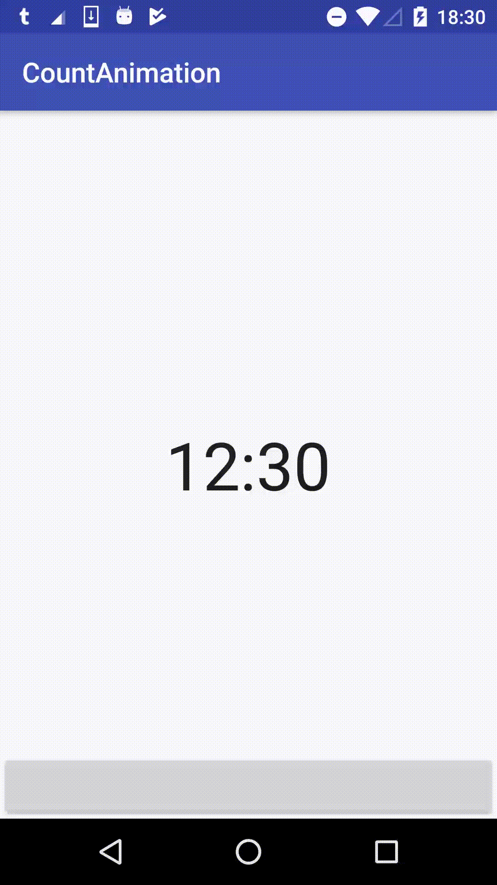

AnimatedClockTextView
====

[](https://jitpack.io/#shts/AnimatedClockTextView)




How to use
----

```xml
    <jp.shts.android.library.animatedclocktext.AnimatedClockTextView
        android:id="@+id/text"
        android:layout_width="wrap_content"
        android:layout_height="wrap_content"
        android:layout_gravity="center"
        android:textSize="48sp"
        app:duration="3000"
        app:hour="12"
        app:minutes="30"
        tools:text="12:30" />
```


```java
        AnimatedClockTextView tv = (AnimatedClockTextView) findViewById(R.id.text);
        tv.setTime(11, 30); // <- 11:30
        tv.setDuration(2000L);
        tv.animateToTime(14, 45);
```


Install
---

```
	allprojects {
		repositories {
			...
			maven { url 'https://jitpack.io' }
		}
	}
```

```
	dependencies {
	        compile 'com.github.shts:AnimatedClockTextView:1.0.0'
	}

```


